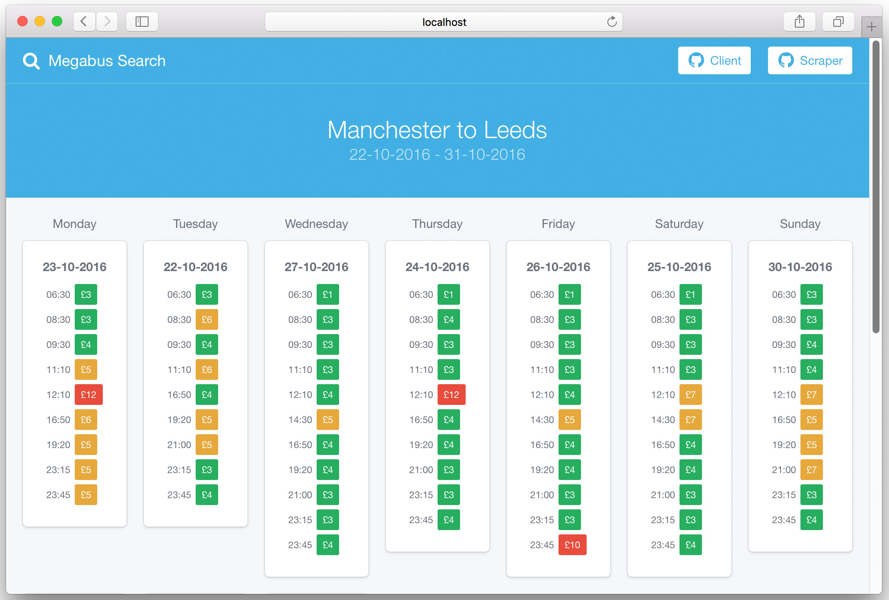

# Megabus UK Price Scraper
A basic user interface built in Vuejs to hook into my megabus price scraper API (https://git.io/vDZOy). Not associated with megabus.com, use at your own discretion.



## Setup
### Environment variables
The app makes use of the dotenv npm package to load environment variables. For your local development envionment you should create a *.env* file in the root of the project with two fields, *API_DOMAIN* and *API_KEY*. These should correspond to the config of your Node.js Scraper API setup (https://git.io/vDZOy). You should also create a *.env.production* file with the same variables, this is used by webpack when building for production.
``` text
API_DOMAIN=
API_KEY=
```

### Commands
``` bash
# install dependencies
npm install

# serve with hot reload at localhost:8080
npm run dev

# minify and build for production 
npm run build
```
